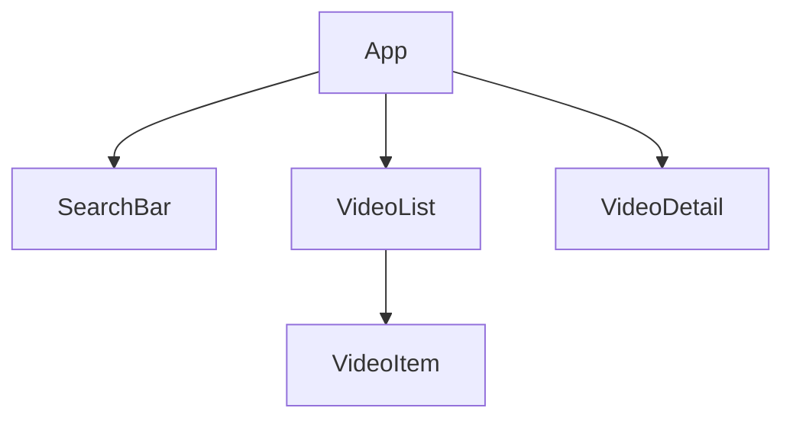

# App design

## Overview

We want to search for a list of videos, click on any search result to feature the video in a player and allow a user to watch it, also add a description in to bottom.

## Components

- SearchBar
- VideoList
- VideoItem
- VideoDetail

## Components relations

