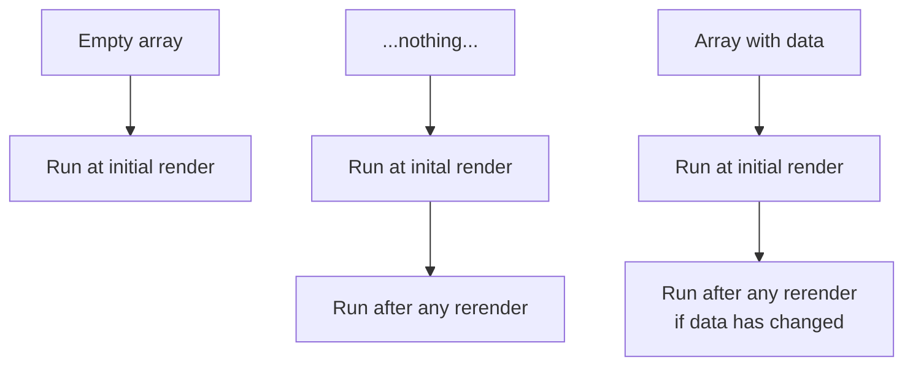

# React hooks

## Primitive hooks

* `useState`
* `useEffect`
* `useContext`
* `useReducer`
* `useCallback`
* `useMemo`
* `useRef`
* `useImperativeHandle`
* `useLayouteffect`
* `useDebugValue`

We use primitive hooks to write our own custom hooks.

## useEffect behavior patterns

